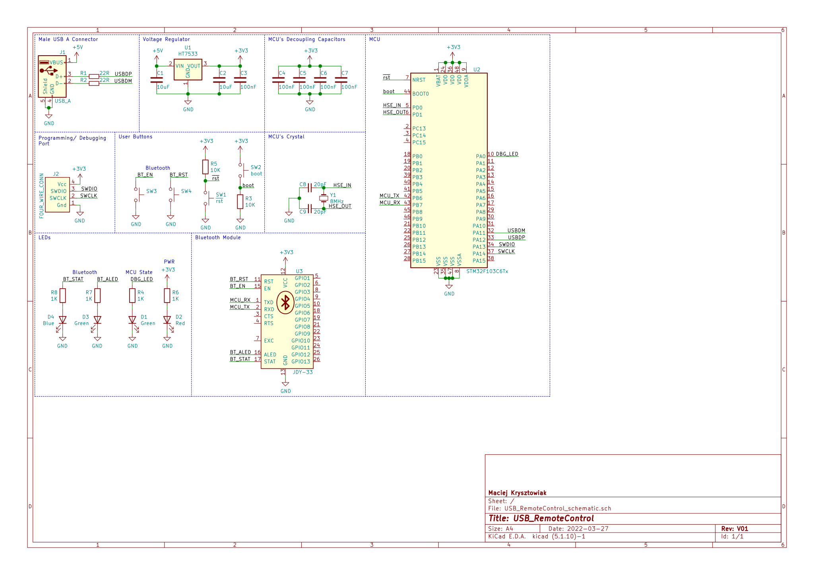
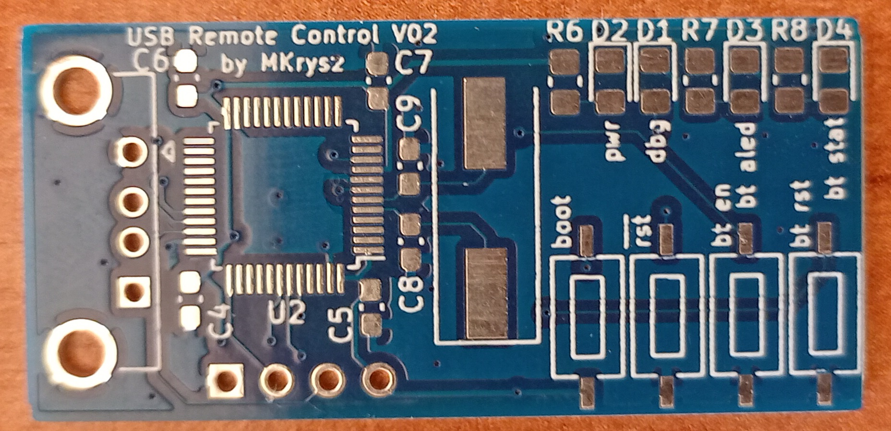
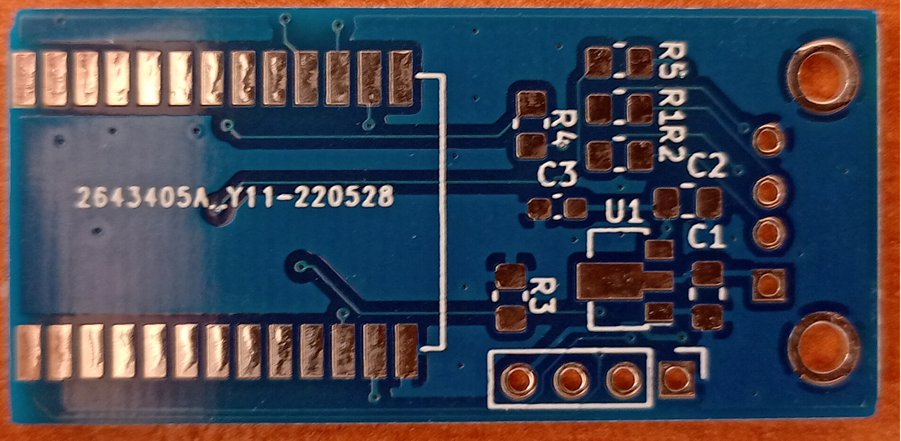
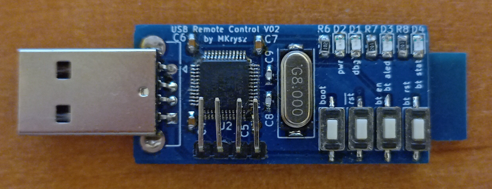
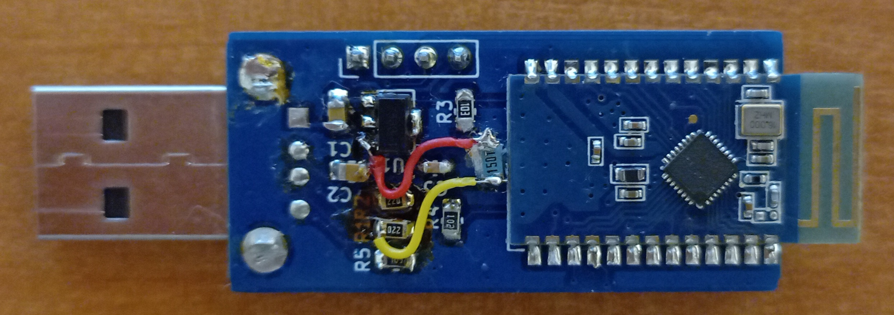
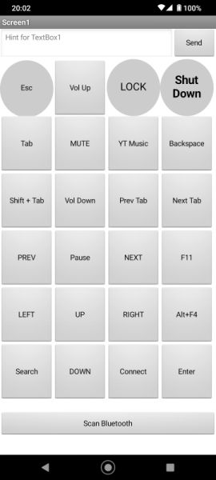

# USB Remote Control

## About

The goal of this project was to make an USB keyboard device that would connect to your phone via Bluetooth and allow you to control your PC with your phone with minimal setup. That was possible using a standard USB HID protocol so that every computer working with HID devices will also work with this device without any additional software. Only setup is needed on smartphones side, i.e. installing the app and connecting to the dongle.

**ADD VIDEO presentation**

## Hardware

Schematic was made in KiCad

I used STM32F103C6 MCU as it was the cheapest MCU with USB that I had. For Bluettoth connection I used JDY-33 Bluetooth module that can be easily controlled via UART interface. I also added some LEDs and buttons for showing information like state of connection.

The boards were manufactured by JLCPCB

After soldering everything and trying to test the board I found out I could get it to connect to PC via USB. After some research I found out that my MCU is one of few from STM32 family that does not embed pullup resistor on D+ line, so I had to add it. Fully assembled device is shown below:

<!-- ## Embedded Software

Embedded software was made using [STM32CubeMX](https://www.st.com/en/development-tools/stm32cubemx.html) and VSCode using [stm32-for-vscode](https://github.com/bmd-studio/stm32-for-vscode) extension.

**Think about what to write here (maybe smth about USB descriptor?)** -->

## Android App

Android App was made using [MIT App Inventor](https://appinventor.mit.edu/), and in design it tries to imitate classical remote control with some additional functions like send text. Current version heavily supports controlling YTMusic web player.

